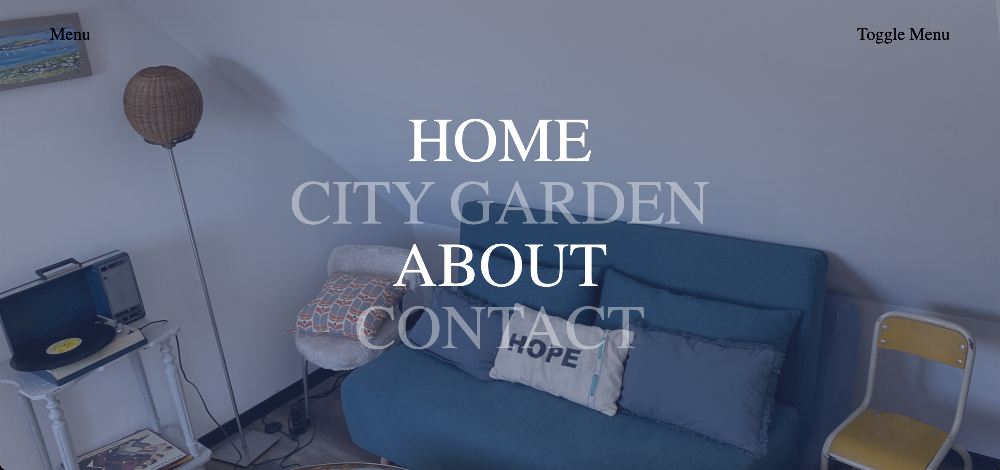

# React Menus Components

## FullScreenMenu




### Installation

```jsx
yarn add @noe-p/react-menus-components
```

### Usage

```jsx
import { FullScreenMenu, LinkMenuType } from '@noe-p/react-menus-components';
import { useState } from 'react';
import styled from 'styled-components';

export function Navigation(): JSX.Element {
  const [isMenuOpen, setIsMenuOpen] = useState(false);
  const linksList: LinkMenuType[] = [
    {
      label: 'Home',
      image: '/images/home-cinema.png',
      route: '/',
    },
    {
      label: 'City Garden',
      image: '/images/salon.png',
      route: '/city-garden',
    },
    { label: 'About', image: '/images/home-cinema.png', route: '/about' },
    { label: 'Contact', image: '/images/salon.png', route: '/contact' },
  ];

  return (
    <>
      <NavBarStyled>
        <a href='/'>{'Menu'}</a>
        <a onClick={() => setIsMenuOpen(!isMenuOpen)}>{'Toggle Menu'}</a>
      </NavBarStyled>
      <FullScreenMenu
        backgroundColor={'rgb(43, 58, 103)'}
        transparentBackgroundColor={'rgba(43, 58, 103, 0.5)'}
        linksList={linksList}
        isMenuOpen={isMenuOpen}
        setIsMenuOpen={setIsMenuOpen}
      />
    </>
  );
}

const NavBarStyled = styled.div`
  display: flex;
  align-items: center;
  justify-content: space-between;
  position: fixed;
  padding-inline: 5%;
  width: 90vw;
  height: 100px;
  z-index: 100000;
  
    color: black;
    text-decoration: none;
    font-size: 25px;

    &:hover {
      cursor: pointer;
    }
  }
`;
```

### R**equired** Props

| Props | Type | Description |
| --- | --- | --- |
| isMenuOpen | boolean | Boolean to open the menu |
| setIsMenuOpen | function(value: boolean) | function for close the menu |
| linksList | LinkMenuType[] | List of links {label, image, route} |

### Optional Props

| Props | Default | Type | Description |
| --- | --- | --- | --- |
| titleAnimationSpeed | 0.4 | number | Title animation duration (seconds) |
| openModalAnimationDuration | 0.7 | number | Menu animation duration (seconds) |
| titleAnimationDelay | 0.4 | number | Title animation delay (seconds) |
| horizontalSlide | 100 | number | Link heights (px) at the start of the animation (can have a negative value) |
| backgroundZoom | 1.05 | number | Zoom on the image when the mouse is over a link (ratio, 1 = no zoom) |
| backgroundColor | black | string | Menu background color |
| transparentBackgroundColor | rgba(0,0,0,0.5) | string | Image filter color  |
| titleColor | white | string | Title color |
| titleFontSize | 90px | string | Title font size |
| titleFontfamily | serif | string | Title font family  |
| titleMobileFontSize | 13vw | string | Title smartphone font size |
| isMenuRounded | true | boolean | Rounded border bottom menu during animation |